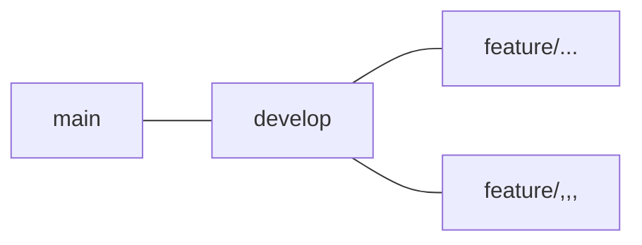

# 🏆Git Swipe🏆
## Beyond CTAとは...？
2022年1月〜3月で開催されたサイバーエージェントさんが企画する長期育成型プログラム"CA Tech Accel"(略してCTA)で出会った24卒iOSチームの3人が、この企画終了後に集まり、チーム開発を行っています。

"Beyond CTA"というチーム名は、 `CTAを超える、CTAのその先へ` という思いから決めました。

## スクリーンショット
 
 

## セットアップ
```
$ make setup
```  
で  
```
$ mint bootstrap
$ make xcodegen
$ bundle pod install
$ open ./${WORKSPACE_NAME}
```  
が実行される。

## 使用技術・ライブラリ
### アーキテクチャ  
MVVM
### ライブラリ
- Moya
- PKHUD
- RxSwift
- RxCocoa
- SnapKit
- SwiftGen
- SwiftLint
- Unio
- XcodeGen
### その他
- [Figma](https://www.figma.com/file/sLbu3KNLdt6zdDQCIYymzu/GitSwipe-(Preview)?node-id=0%3A1)
- GitHub API

## 開発ルール
### Git flow


- mainブランチからdevelopブランチを切り、そこからfeature ○○のようにブランチを切って作業する。
- mainブランチはリリース用ブランチとする。

### コミットメッセージ
以下のように英語で書く。

- 追加 : `Add ○○`
- 更新 : `Update ○○`
- 修正 : `Fix ○○`
- 削除 : `Delete ○○`

## 開発フロー
30分から1時間程度のZOOMミーティングを複数回行い、それぞれの進捗報告と次回ミーティングまでのTODOを決める。  
基本的にはSlackでコミュニケーションを行う。  
SlackとGitHubを連携させ、通知に気が付きやすいようにする。  
わからないことがでてきたり、開発に詰まったりしたら、気軽にSlackで聞く→各々得意不得意があるので、深い理解を持っている人に聞いた方が開発が早く進む。（聞かれた人もアウトプットになり、さらに知識を深められる。）  
実装が完了したらPRを出し、Approveをもらったらマージする。（簡単なPRの場合、Slackで確認の上でセルフマージも可）